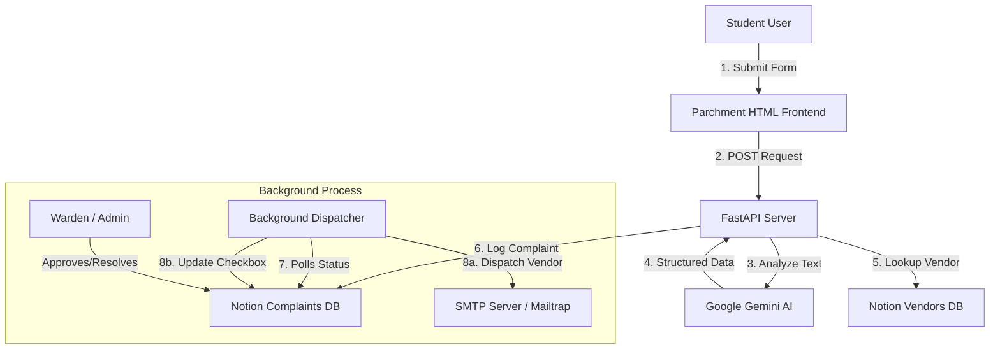

# FixBit 🔧
### **Smart Hostel Maintenance System**
*An AI-powered, Notion-integrated, automated routing and dispatch system for hostel maintenance.*

---

## 🌟 Overview
**FixBit** is a modern, premium web-based solution designed to streamline the chaotic process of hostel maintenance. Instead of filing manual paperwork or navigating complex forms, students submit a simple, raw description of their issue. FixBit uses the latest **Google Gemini AI** to understand the complaint, extract key details, categorize it, and sync it to a **Notion database**. 

From there, the system automatically routes the issue to the appropriate vendor, monitors approval workflows, and notifies students when their issue is resolved.

---

## 🚀 Key Features

*   **Premium Parchment UI**: An elegant, responsive medieval-parchment-themed interface that stands out instantly.
*   **Gemini AI-Powered Parsing**: Converts messy student descriptions (e.g., *"fan making noise in B-204"*) into structured JSON data extraction (room, category, urgency).
*   **Notion as a Database**: Leverages Notion databases for live tracking of complaints and vendor assignments, providing warden/admin dashboards with zero custom frontend code.
*   **Smart Auto-Routing**: Fast-tracks low-to-medium urgency complaints for instant dispatch while queueing high-urgency/complex complaints for Warden approval.
*   **Automated Email Dispatch Loop**: A background worker polls Notion to notify vendors via email when tasks are assigned, and notifies students directly when their ticket status changes to `Resolved`.

---

## 🛠️ Tech Stack

*   **Frontend**: Vanilla HTML5, CSS3 (Premium custom parchment styling, responsive flexbox layout, CSS variables).
*   **Backend**: Python, FastAPI (High-performance API framework), Uvicorn (ASGI server), `pydantic` (Data validation).
*   **AI Engine**: Google Gemini API via the official `google-genai` SDK (running dynamic, schema-enforced prompt analysis).
*   **Database & Panel**: Notion API (Official Notion REST API Integration) acting as the primary database and Warden admin panel.
*   **Notifications**: SMTP protocol (Python `smtplib` / `email.message`), integrated with Mailtrap (sandbox testing) and supports live SMTP providers (e.g. Gmail).

---

## 🛠️ System Architecture



---

## 🔌 Setup & Installation

Follow these steps to run the application locally:

### 1. Prerequisites
Make sure you have **Python 3.10+** installed on your system.

### 2. Configure Environment Variables
Create a `.env` file in the root folder (or copy from `.env.example`) and fill in your credentials:
```ini
# AI Engine
GEMINI_API_KEY=your_gemini_api_key
GEMINI_MODEL=gemini-3.5-flash-lite

# Database (Notion Integration)
NOTION_TOKEN=your_notion_integration_token
COMPLAINTS_DATABASE_ID=your_complaints_database_id
VENDORS_DATABASE_ID=your_vendors_database_id

# Mail System (SMTP Configuration)
MAILTRAP_HOST=sandbox.smtp.mailtrap.io
MAILTRAP_PORT=2525
MAILTRAP_USERNAME=your_smtp_username
MAILTRAP_PASSWORD=your_smtp_password
MAIL_FROM=noreply@hostelmaintenance.local
```

### 3. Install Dependencies
Install all required libraries using pip:
```bash
pip install -r requirements.txt
```

### 4. Start the Application
Run the FastAPI backend server:
```bash
py -m uvicorn main:app --port 8080 --reload
```
*(If `py` is not recognized, use `python` or `python3` instead).*

### 5. Access the Web App
Open your browser and navigate to:
👉 **[http://127.0.0.1:8080](http://127.0.0.1:8080)**

---

## 💡 How It Works (For Judges)

We recommend testing the full flow using the steps below:

### Phase 1: Submit a Complaint
1. Open the website at `http://127.0.0.1:8080`.
2. Enter a room number (e.g., `B-204`), your email address, and describe an issue (e.g., *"The ceiling fan is making a rattling noise and there is a bad smell"*).
3. Click **Submit Complaint**.
4. **FixBit** sends the description to **Gemini AI**, which dynamically:
   * Categorizes the issue as **Electrical**.
   * Identifies the urgency level (**Low/Medium/High**).
   * Extracts location.
   * Auto-assigns the configured vendor for Electrical tasks (e.g., *ElectroFix*).
5. The complaint is instantly synced to your Notion database, and the page renders a digital receipt showing the AI's classification.

### Phase 2: Automatic Vendor Dispatch
1. The background process runs every 30 seconds.
2. It detects the new complaint in Notion, pulls the vendor's email address from the **Vendors DB**, and sends them an email containing the ticket details.
3. The server updates the status in Notion from `Auto-Approved` or `Approved` to **`Dispatched`**.

### Phase 3: Marking as Resolved
1. Go to your **Notion Complaints Database**.
2. Change the **Status** select box for the complaint to **`Resolved`**.
3. Leave the **`Resolution Email Sent`** checkbox unchecked.
4. Within 30 seconds, the background thread detects the change:
   * It sends a professional resolution update email to the student's email address.
   * It automatically checks the **`Resolution Email Sent`** checkbox in Notion to log that the notification was sent.
